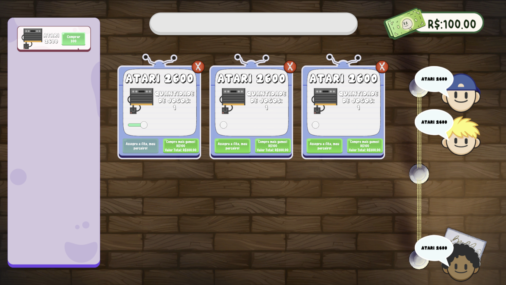
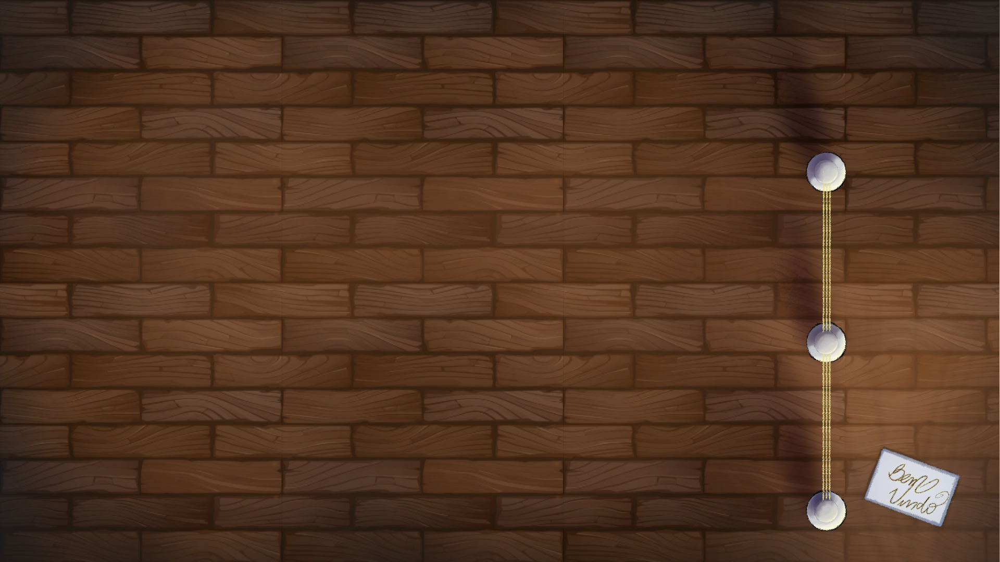
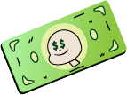
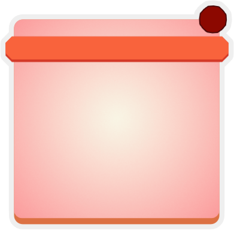
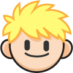
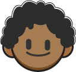
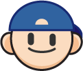
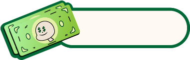

<p align="center" style="margin-top: 10px">
  
</p>

<h1 align="center">GameStore Tycoon</h1>

<p align="center">Um jogo de gerenciamento onde o jogador administra sua própria loja de videogames e evolui seu império conforme atende clientes e desbloqueia novas plataformas.</p>

---

## 🎮 Sobre o Projeto

**GameStore Tycoon** é um jogo casual de gerenciamento em 2D que simula a rotina de uma loja de videogames. O jogador deve comprar novas plataformas, atender clientes, acumular receita e expandir seu negócio ao longo do tempo.

<p align="center" style="margin-top: 10px">
  
</p>

---

## 🧱 Arquitetura Utilizada

O projeto adota uma arquitetura em camadas que organiza e separa responsabilidades de forma modular:

- **Model:** Contém as classes que representam os dados do jogo (ex: `GameStore`, `VideoGameData`, `PlayerRequest`, `GameSoundData`).
- **Interface:** Define os contratos que são implementados pelos repositórios e controladores (ex: `IGameStoreRepository`, `IGameSoundRepository`, `IGameInfoRepository`).
- **Repository:** Implementa as interfaces com manipulações concretas dos dados, seja em tempo real, scriptável ou em memória.
- **Controller:** Gerencia a lógica de negócios e regras de cada módulo (ex: compra e venda, desbloqueio, som, sessão de jogatina).
- **Manager (MonoBehaviours):** Controla os comportamentos visuais e interações com a cena. São os componentes ligados diretamente aos GameObjects e UI.

Esse padrão facilita manutenções, refatorações e expansões futuras no projeto, como adicionar novos minigames ou modos de desafio.

---

## 🎨 Artes e UI

As artes foram produzidas especialmente para o jogo, mantendo um visual estilizado e coerente com a proposta de um ambiente retrô-arcade.

### Rasterizadas:
- **Background**: cenário principal do jogo, em bitmap.

<p align="center" style="margin-top: 10px">
  
</p>

- **UI da Coin**: efeito visual animado da moeda coletada após cada atendimento.

<p align="center" style="margin-top: 10px">
  
</p>

### Vetoriais:
- **Card de Compra de Games**: usado para exibir informações de cada videogame disponível.

<p align="center" style="margin-top: 10px">
  
</p>

- **StoreCard**: painel que representa visualmente cada loja comprada e suas ações disponíveis.

<p align="center" style="margin-top: 10px">
  
</p>

- **Avatares dos Jogadores (3 sprites diferentes)**: representações gráficas dos clientes na fila.

<p align="center" style="margin-top: 10px">
  
</p>
<p align="center" style="margin-top: 10px">
  
</p>
<p align="center" style="margin-top: 10px">
  
</p>

- **Ícones de plataformas de videogame**: utilizados nos botões de compra e nas sessões.
<p align="center" style="margin-top: 10px">
  
</p>
---

## ⚙️ Mecânicas e Funcionalidades

- Fila dinâmica de jogadores com animação de chegada e atendimento.
- Sessões de jogatina com slider representando o tempo de uso.
- Ganhos proporcionais ao tempo e quantidade de lojas.
- Desbloqueio progressivo de novos videogames (5, 10, 15... jogadores atendidos).
- Feedback visual e sonoro para ações como compra, venda, e término de sessão.
- Mensagens informativas e centralizadas na tela para reforçar feedbacks.
- Controle de som por sistema modular.
- Animação de moeda fluindo da loja para o contador de dinheiro ao término da sessão.
- Menu inicial com botão de Start.

---

## 🚀 Como Rodar

1. Clone este repositório:
   ```bash
   git clone https://github.com/LeonardoRaiz/GameHouseTycoon.git
   ```
2. Abra o projeto no Unity (versão recomendada: 2022.3 LTS ou superior).
3. Execute a cena MainMenu.unity.